# Proposal-NNNN: Hardware Awareness scheduler based on NFD 

## Authors

Le, Huifeng

Xu, Stephen

## Summary

NFD (Node Feature Discovery: https://github.com/kubernetes-sigs/node-feature-discovery) enables node feature discovery for Kubernetes. It detects hardware features available on each node in a Kubernetes cluster, and advertises those features using node labels. The NodeFeatureRule objects provide an easy way to create vendor or application specific labels. This PR targets to enable Hardware Awareness (e.g. cluster features) based application scheduler in clusternet.

## Motivation

Enable Hardware Awareness (e.g. cluster features) based application scheduler allows clusternet administrator to better utilize cluster hardware resource for applications.

### Goals

Calculate cluster features in NFD enabled child clusters
Filter cluster based on cluster feature

### Non-Goals
Install NFD in child cluster

## Proposal

### User Stories (Optional)

#### Story 1: 
As clusternet administrator, I want to define cluster feature as combination of child cluster node's hardware feature, such as CPU, FPGA etc.

#### Story 2: 
As clusternet administrator, I want to deploy my application to child clusters with required hardware features

### Notes/Constraints/Caveats (Optional)

### Risks and Mitigations

Add-on scheduling mechanism on existing clusternet scheduler. 

## Design Details

1. API Definition:

N/A

2. Agent

agent's status manager: calculate ClusterFeatures based on node label combination (e.g. "or" for node label with prefix like "node.clusternet.io/cluster-feature/") and report to hub in ManagerCluster's labels

3. Scheduler:

Flow update: 
  if subscription includes resource NodeFeatureRule, (1) add NodeFeatureRule CRD resource (2) append prefix such as "node.clusternet.io/cluster-feature/" in resource's labels

NodeFeatureRule Sample: https://github.com/kubernetes-sigs/node-feature-discovery/blob/master/deployment/base/nfd-crds/cr-sample.yaml

```yaml
apiVersion: nfd.k8s-sigs.io/v1alpha1
kind: NodeFeatureRule
metadata:
  name: my-sample-rule-object
spec:
  rules:
    - name: "my sample rule"
      labels:
        "my-sample-feature": "true"
      matchFeatures:
        - feature: kernel.loadedmodule
          matchExpressions:
            dummy: {op: Exists}
        - feature: kernel.config
          matchExpressions:
            X86: {op: In, value: ["y"]}
```

4. Sequence flow:

```mermaid
sequenceDiagram
    actor admin
    participant S as Scheduler
    participant H as Hub
    participant HK as Hub K8s API Server
    participant A as Agent
    participant EK as Edge K8s API Server
    participant NM as nfd-master
    
    %% Cluster Registration
    A->>HK: ClusterRegistrationRequests (cid, ctype, syncmode, labels)
    HK->>H: CR: ClusterRegistrationRequest
    H->>HK: create namespace, serviceaccount, rbac
    H->>HK: create ManagerCluster
    H->>HK: update ClusterRegistertionRequest Status
    A->>A: waitingForApproval
    HK->>A: CR: ClusterRegistrationRequest
    
    %% Cluster Status update
    loop Roll Update
        A->>EK: Get Cluster Status
        A->>A: calculate ClusterFeatures: node label combination (e.g. "or" for prefix with "node.clusternet.io/cluster-feature/")
        A->>HK: ManagerCluster's label with ClusterFeatures
    end
    
    %% Subscription
    admin->>HK: new Subscription
    Note over admin: 1. Subscription for CR NodeFeatureRule (day 1) 
    Note over admin: 2. Subscription with cluster feature label in clusterAffinity (day 2)
    HK->>S: CR: Subscription created/updated
    S->>S: scheduleOne
    S->>S: scheduleAlgorithm.Schedule()
    Note over S: if feed is NodeFeatureRule: add NodeFeatureRule CRD resource and append prefix (e.g. node.clusternet.io/cluster-feature/) in NodeFeatureRule’s labels
    S->>S: bind
    S->>HK: Update CR: Subscription (BindingClusters, Replicas)
    HK->>H: CR: Subscription
    loop cluster
        H->>HK: Create Base(namespace, feeds, labels)
        loop feed
            H->>HK: Create Localization
            H->>HK:  CR: Description (namespace, clusterId, clusterName, Charts, raw
        end
    end
    HK->>A: CR: Description
    A->>EK: dynamicClient.Resource
    A->HK: Update CR Status : Description
    SK->>NM: CR: NodeFeatureRule changed
    NM->>EK: Set Node Label Such as: "HA1": "true"
```



### Test Plan

### Version Skew Strategy

### Feature Enablement and Rollback

### Dependencies

### Scalability

### Drawbacks

### Alternatives
