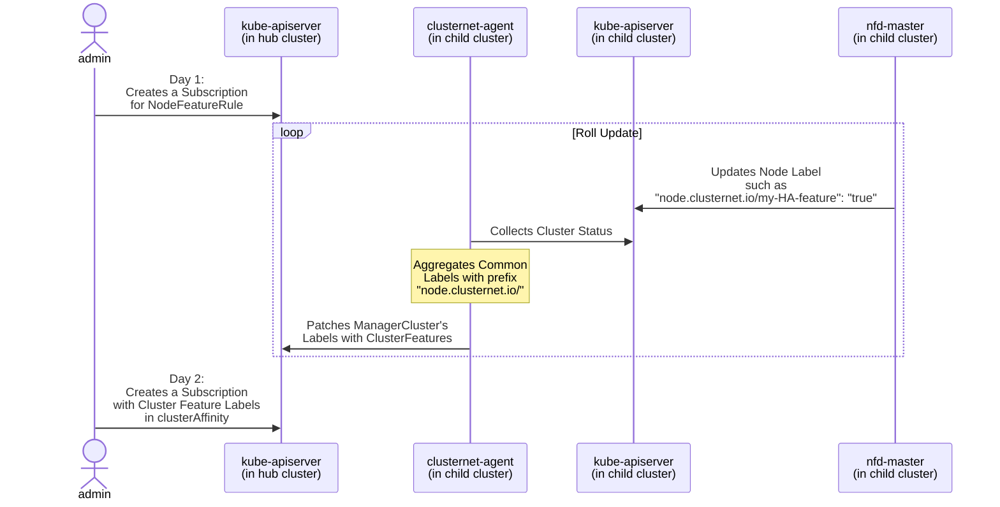

## Authors

Le, Huifeng (intel)

Xu, Di

## Summary

NFD ([Node Feature Discovery](https://github.com/kubernetes-sigs/node-feature-discovery)) enables node feature discovery
for Kubernetes. It detects hardware features available on each node in a Kubernetes cluster, and advertises those
features using node labels. The
[NodeFeatureRule](https://github.com/kubernetes-sigs/node-feature-discovery/blob/master/deployment/base/nfd-crds/cr-sample.yaml)
objects provide an easy way to
create [vendor or application specific labels](https://kubernetes-sigs.github.io/node-feature-discovery/v0.11/get-started/features.html)
, including CPU families, Kernel, SR-IOV enabled Network, NUMA architecture, etc. This PR targets to enable Hardware
Awareness (e.g. cluster features) for clusternet scheduling.

## Motivation

Provides hardware awareness labels for child clusters, which can be very useful for users to select desired clusters for
applications.

### Goals

- Discovers cluster features by enabling [NFD](https://github.com/kubernetes-sigs/node-feature-discovery) in child
  clusters

### Non-Goals

- Installs NFD in each child cluster

## Proposal

### User Stories (Optional)

- I want to know the hardware characteristics of child clusters, such as CPU, FPGA etc.
- I want to deploy my applications to child clusters with required hardware features.

## Design Details



Before getting started, custom resource
[NodeFeatureRule](https://kubernetes-sigs.github.io/node-feature-discovery/v0.11/advanced/customization-guide.html?highlight=NodeFeatureRule#nodefeaturerule-custom-resource)
need to be created in desired child clusters. We can create a `Subscription` with adding
[NodeFeatureRule](https://kubernetes-sigs.github.io/node-feature-discovery/v0.11/advanced/customization-guide.html?highlight=NodeFeatureRule#nodefeaturerule-custom-resource)
as a feed. `clusternet` will help create those rules in child clusters.

`nfd-master` running in each child cluster will get notified of
[NodeFeatureRule](https://kubernetes-sigs.github.io/node-feature-discovery/v0.11/advanced/customization-guide.html?highlight=NodeFeatureRule#nodefeaturerule-custom-resource)
and start labelling all the nodes in current child cluster. `clusternet-agent` periodically collects information from
current child cluster and aggregates common node labels that have prefix `node.clusternet.io/`. Those common labels will
be patched to `ManagedCluster` by `clusternet-agent`.

Below is a sample NodeFeatureRule.

```yaml
apiVersion: nfd.k8s-sigs.io/v1alpha1
kind: NodeFeatureRule
metadata:
  name: my-sample-rule-object
spec:
  rules:
    - name: "my sample rule"
      labels:
        "node.clusternet.io/my-HA-feature": "true"
      matchFeatures:
        - feature: kernel.loadedmodule
          matchExpressions:
            dummy: { op: Exists }
        - feature: kernel.config
          matchExpressions:
            X86: { op: In, value: [ "y" ] }
```

Other cr samples

- <https://github.com/kubernetes-sigs/node-feature-discovery/blob/master/deployment/base/nfd-crds/cr-sample.yaml>
